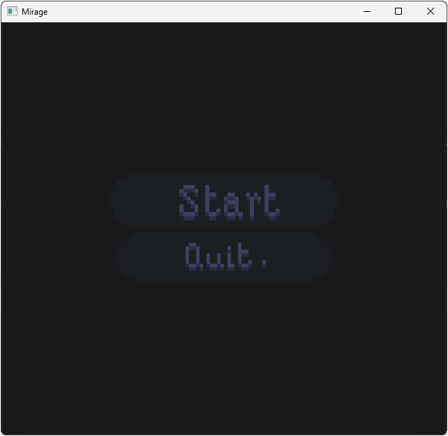
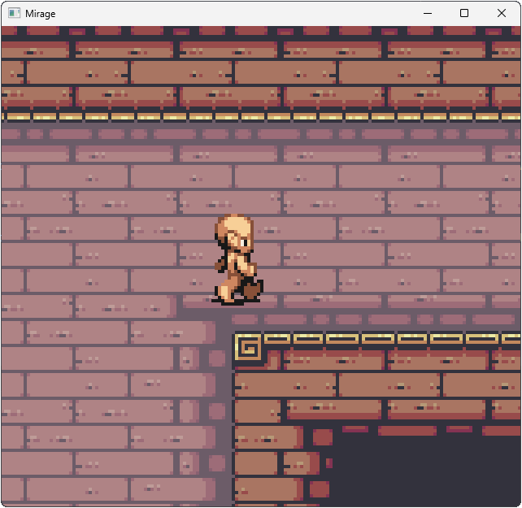

# Illusion Engine
**lwjgl game** engine used to make **rpg games**.
still work in progress and it's main purpose is as a learning project.

[**dont** use this to make anything serious XD]

if you want to try making a game, it is best to edit the default sample game (it has some core rpg tech implemented into it)

## features
- Batch Rendering
- 2D Camera System
- ECS
- Texture Loading
- GLSL Shader Loading
- SpriteSheets
- Framebuffers
- ImGui implementation

## Planned Features
- Animation System
- State Machines
- Build System
- Level Editor* (maybe)
  - if level editor isn't integrated into the engine, probably a way to import Tiled or LDtk files 

 